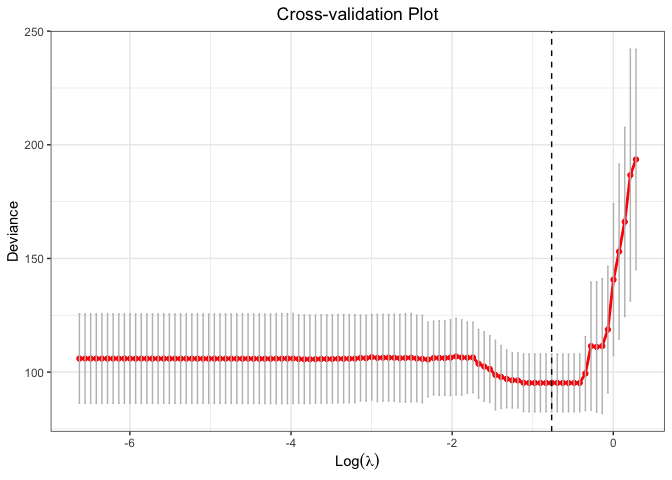
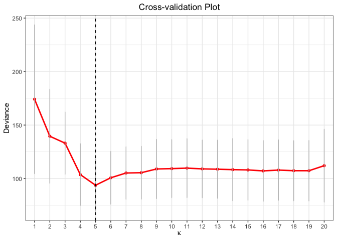
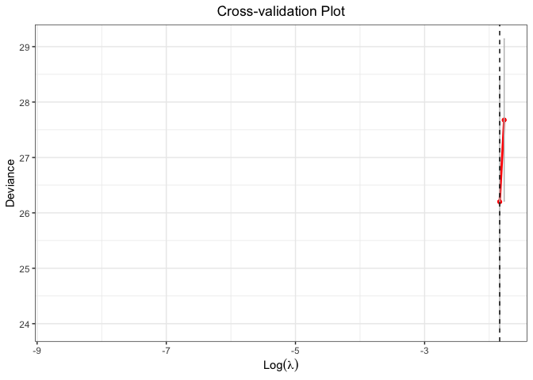
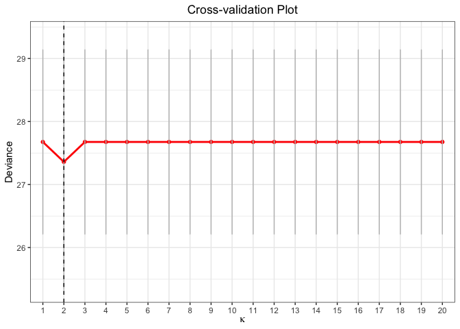
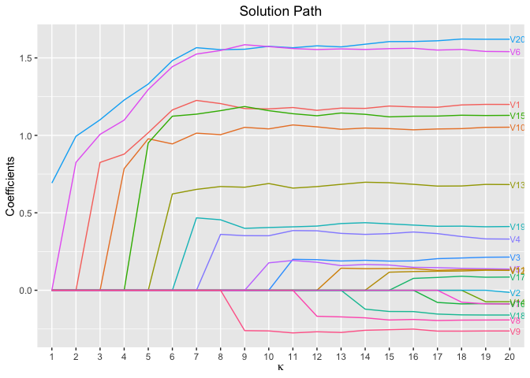
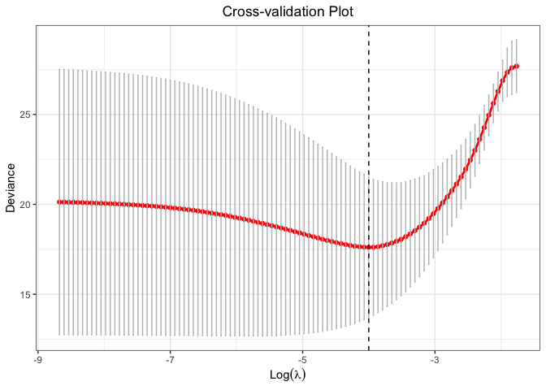
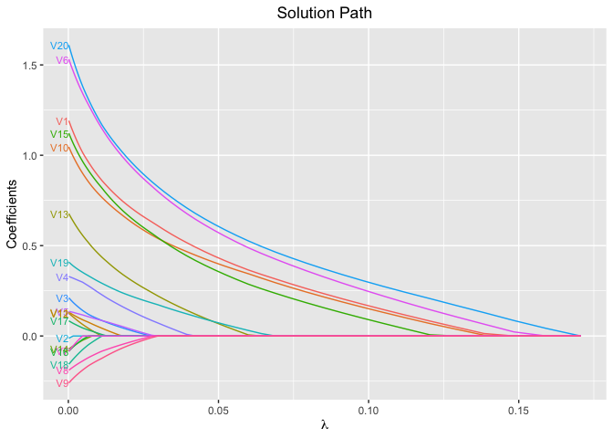

<!-- README.md is generated from README.Rmd. Please edit that file -->

# **glmtlp**: An R Package For Truncated Lasso Penalty

<!-- badges: start -->
[](https://cran.r-project.org/package=glmtlp)
[](https://cran.r-project.org/package=glmtlp)
[](https://github.com/yuyangstat/glmtlp_cran/actions/workflows/R-CMD-check.yaml)
<!-- badges: end -->

<p align="center">

</p>

Efficient procedures for constrained likelihood estimation with truncated lasso penalty (Shen et al., 2010; Zhang 2010) for linear and generalized linear models.

**Note**: this is a repo for the version published on CRAN. Please check [chunlinli/glmtlp](https://github.com/chunlinli/glmtlp) for new features such as constrained likelihood inference, regression on summary data, memory efficiency, Gaussian graphical models, and more.

## Installation

You can install the released version of glmtlp from
[CRAN](https://CRAN.R-project.org) with:

``` r
install.packages("glmtlp")
```

## Examples for Gaussian Regression Models

The following are three examples which show you how to use `glmtlp` to
fit gaussian regression models:

``` r
library(glmtlp)
data("gau_data")
colnames(gau_data$X)[gau_data$beta != 0]
#> [1] "V1"  "V6"  "V10" "V15" "V20"
```

``` r
# Cross-Validation using TLP penalty
cv.fit <- cv.glmtlp(gau_data$X, gau_data$y, family = "gaussian", penalty = "tlp", ncores=2)
coef(cv.fit)[abs(coef(cv.fit)) > 0]
#>    intercept           V1           V6          V10          V15          V20 
#> -0.009678041  1.240223517  0.883202180  0.725708239  1.125994003  0.981402236
plot(cv.fit)
```



``` r

# Single Model Fit using TLP penalty
fit <- glmtlp(gau_data$X, gau_data$y, family = "gaussian", penalty = "tlp")
coef(fit, lambda = cv.fit$lambda.min)
#>    intercept           V1           V2           V3           V4           V5 
#> -0.009678041  1.240223517  0.000000000  0.000000000  0.000000000  0.000000000 
#>           V6           V7           V8           V9          V10          V11 
#>  0.883202180  0.000000000  0.000000000  0.000000000  0.725708239  0.000000000 
#>          V12          V13          V14          V15          V16          V17 
#>  0.000000000  0.000000000  0.000000000  1.125994003  0.000000000  0.000000000 
#>          V18          V19          V20 
#>  0.000000000  0.000000000  0.981402236
predict(fit, X = gau_data$X[1:5, ], lambda = cv.fit$lambda.min)
#> [1]  0.1906465  2.2279723 -1.4256042  0.9313886 -2.8152522
plot(fit, xvar = "log_lambda", label = TRUE)
```


``` r
# Cross-Validation using L0 penalty
cv.fit <- cv.glmtlp(gau_data$X, gau_data$y, family = "gaussian", penalty = "l0", ncores=2)
coef(cv.fit)[abs(coef(cv.fit)) > 0]
#>    intercept           V1           V6          V10          V15          V20 
#> -0.009687042  1.240319880  0.883378583  0.725607300  1.125958218  0.981544178
plot(cv.fit)
```



``` r
# Single Model Fit using L0 penalty
fit <- glmtlp(gau_data$X, gau_data$y, family = "gaussian", penalty = "l0")
coef(fit, kappa = cv.fit$kappa.min)
#>    intercept           V1           V2           V3           V4           V5 
#> -0.009687042  1.240319880  0.000000000  0.000000000  0.000000000  0.000000000 
#>           V6           V7           V8           V9          V10          V11 
#>  0.883378583  0.000000000  0.000000000  0.000000000  0.725607300  0.000000000 
#>          V12          V13          V14          V15          V16          V17 
#>  0.000000000  0.000000000  0.000000000  1.125958218  0.000000000  0.000000000 
#>          V18          V19          V20 
#>  0.000000000  0.000000000  0.981544178
predict(fit, X = gau_data$X[1:5, ], kappa = cv.fit$kappa.min)
#> [1]  0.190596  2.228306 -1.425994  0.931749 -2.815322
plot(fit, xvar = "kappa", label = TRUE)
```


``` r
# Cross-Validation using L1 penalty
cv.fit <- cv.glmtlp(gau_data$X, gau_data$y, family = "gaussian", penalty = "l1", ncores=2)
coef(cv.fit)[abs(coef(cv.fit)) > 0]
#>   intercept          V1          V3          V4          V5          V6 
#> -0.01185622  1.16222899 -0.06606911 -0.08387185 -0.06870578  0.79106593 
#>          V8          V9         V10         V11         V14         V15 
#>  0.01136376  0.01038075  0.62580166  0.10858744  0.08533479  1.04737369 
#>         V19         V20 
#> -0.11859786  0.86736897
plot(cv.fit)
```


``` r
# Single Model Fit using L1 penalty
fit <- glmtlp(gau_data$X, gau_data$y, family = "gaussian", penalty = "l1")
coef(fit, lambda = cv.fit$lambda.min)
#>   intercept          V1          V2          V3          V4          V5 
#> -0.01185622  1.16222899  0.00000000 -0.06606911 -0.08387185 -0.06870578 
#>          V6          V7          V8          V9         V10         V11 
#>  0.79106593  0.00000000  0.01136376  0.01038075  0.62580166  0.10858744 
#>         V12         V13         V14         V15         V16         V17 
#>  0.00000000  0.00000000  0.08533479  1.04737369  0.00000000  0.00000000 
#>         V18         V19         V20 
#>  0.00000000 -0.11859786  0.86736897
predict(fit, X = gau_data$X[1:5, ], lambda = cv.fit$lambda.min)
#> [1]  0.07112074  2.17093497 -1.09936871  0.46108771 -2.25111685
plot(fit, xvar = "lambda", label = TRUE)
```


## Examples for Logistic Regression Models

The following are three examples which show you how to use `glmtlp` to
fit logistic regression models:

``` r
data("bin_data")
colnames(bin_data$X)[bin_data$beta != 0]
#> [1] "V1"  "V6"  "V10" "V15" "V20"
```

``` r
# Cross-Validation using TLP penalty
cv.fit <- cv.glmtlp(bin_data$X, bin_data$y, family = "binomial", penalty = "tlp", ncores=2)
coef(cv.fit)[abs(coef(cv.fit)) > 0]
#>  intercept         V6        V20 
#> -0.1347141  0.8256183  0.9940325
plot(cv.fit)
#> Warning: Removed 98 rows containing missing values or values outside the scale range
#> (`geom_line()`).
#> Warning: Removed 98 rows containing missing values or values outside the scale range
#> (`geom_point()`).
```



``` r
# Single Model Fit using TLP penalty
fit <- glmtlp(bin_data$X, bin_data$y, family = "binomial", penalty = "tlp")
coef(fit, lambda = cv.fit$lambda.min)
#>  intercept         V1         V2         V3         V4         V5         V6 
#> -0.1347141  0.0000000  0.0000000  0.0000000  0.0000000  0.0000000  0.8256183 
#>         V7         V8         V9        V10        V11        V12        V13 
#>  0.0000000  0.0000000  0.0000000  0.0000000  0.0000000  0.0000000  0.0000000 
#>        V14        V15        V16        V17        V18        V19        V20 
#>  0.0000000  0.0000000  0.0000000  0.0000000  0.0000000  0.0000000  0.9940325
predict(fit, X = bin_data$X[1:5, ], type = "response", lambda = cv.fit$lambda.min)
#> [1] 0.42562483 0.89838483 0.09767039 0.90898462 0.20822294
plot(fit, xvar = "log_lambda", label = TRUE)
```


``` r
# Cross-Validation using L0 penalty
cv.fit <- cv.glmtlp(bin_data$X, bin_data$y, family = "binomial", penalty = "l0", ncores=2)
coef(cv.fit)[abs(coef(cv.fit)) > 0]
#>  intercept         V6        V20 
#> -0.1347137  0.8256471  0.9940180
plot(cv.fit)
```



``` r
# Single Model Fit using L0 penalty
fit <- glmtlp(bin_data$X, bin_data$y, family = "binomial", penalty = "l0")
coef(fit, kappa = cv.fit$kappa.min)
#>  intercept         V1         V2         V3         V4         V5         V6 
#> -0.1347137  0.0000000  0.0000000  0.0000000  0.0000000  0.0000000  0.8256471 
#>         V7         V8         V9        V10        V11        V12        V13 
#>  0.0000000  0.0000000  0.0000000  0.0000000  0.0000000  0.0000000  0.0000000 
#>        V14        V15        V16        V17        V18        V19        V20 
#>  0.0000000  0.0000000  0.0000000  0.0000000  0.0000000  0.0000000  0.9940180
predict(fit, X = bin_data$X[1:5, ], kappa = cv.fit$kappa.min)
#> [1] -0.2996886  2.1793764 -2.2234461  2.3012922 -1.3357999
plot(fit, xvar = "kappa", label = TRUE)
```



``` r
# Cross-Validation using L1 penalty
cv.fit <- cv.glmtlp(bin_data$X, bin_data$y, family = "binomial", penalty = "l1", ncores=2)
coef(cv.fit)[abs(coef(cv.fit)) > 0]
#>   intercept          V1          V3          V4          V5          V6 
#> -0.04597434  0.74281436  0.04345031  0.15993696  0.05100859  0.98672196 
#>          V8          V9         V10         V13         V15         V19 
#> -0.04488821 -0.06456282  0.66422939  0.33826482  0.69062166  0.23686317 
#>         V20 
#>  1.01116571
plot(cv.fit)
```



``` r
# Single Model Fit using L1 penalty
fit <- glmtlp(bin_data$X, bin_data$y, family = "binomial", penalty = "l1")
coef(fit, lambda = cv.fit$lambda.min)
#>   intercept          V1          V2          V3          V4          V5 
#> -0.04597434  0.74281436  0.00000000  0.04345031  0.15993696  0.05100859 
#>          V6          V7          V8          V9         V10         V11 
#>  0.98672196  0.00000000 -0.04488821 -0.06456282  0.66422939  0.00000000 
#>         V12         V13         V14         V15         V16         V17 
#>  0.00000000  0.33826482  0.00000000  0.69062166  0.00000000  0.00000000 
#>         V18         V19         V20 
#>  0.00000000  0.23686317  1.01116571
predict(fit, X = bin_data$X[1:5, ], type = "response", lambda = cv.fit$lambda.min)
#> [1] 0.35132374 0.90851038 0.03822033 0.93657911 0.03253188
plot(fit, xvar = "lambda", label = TRUE)
```



## Citing information

If you find this project useful, please consider citing

    @article{
        author = {Chunlin Li, Yu Yang, Chong Wu, Xiaotong Shen, Wei Pan},
        title = {{glmtlp: An R package for truncated Lasso penalty}},
        year = {2022}
    }

## References

Li, C., Shen, X., & Pan, W. (2021). Inference for a large directed
graphical model with interventions. *arXiv preprint* arXiv:2110.03805.
<https://arxiv.org/abs/2110.03805>.

Shen, X., Pan, W., & Zhu, Y. (2012). Likelihood-based selection and
sharp parameter estimation. *Journal of the American Statistical
Association*, 107(497), 223-232.
<https://doi.org/10.1080/01621459.2011.645783>.

Shen, X., Pan, W., Zhu, Y., & Zhou, H. (2013). On constrained and
regularized high-dimensional regression. *Annals of the Institute of
Statistical Mathematics*, 65(5), 807-832.
<https://doi.org/10.1007/s10463-012-0396-3>.

Tibshirani, R., Bien, J., Friedman, J., Hastie, T., Simon, N., Taylor,
J., & Tibshirani, R. J. (2012). Strong rules for discarding predictors
in lasso‐type problems. *Journal of the Royal Statistical Society:
Series B (Statistical Methodology)*, 74(2), 245-266.
<https://doi.org/10.1111/j.1467-9868.2011.01004.x>.

Yang, Y. & Zou, H. A coordinate majorization descent algorithm for l1
penalized learning. *Journal of Statistical Computation and Simulation*
84.1 (2014): 84-95. <https://doi.org/10.1080/00949655.2012.695374>.

Zhu, Y., Shen, X., & Pan, W. (2020). On high-dimensional constrained
maximum likelihood inference. *Journal of the American Statistical
Association*, 115(529), 217-230.
<https://doi.org/10.1080/01621459.2018.1540986>.

Zhu, Y. (2017). An augmented ADMM algorithm with application to the
generalized lasso problem. *Journal of Computational and Graphical
Statistics*, 26(1), 195-204.
<https://doi.org/10.1080/10618600.2015.1114491>.

Part of the code is adapted from
[**glmnet**](https://github.com/cran/glmnet),
[**ncvreg**](https://github.com/pbreheny/ncvreg/), and
[**biglasso**](https://github.com/pbreheny/biglasso/).

**Warm thanks to the authors of above open-sourced softwares.**
